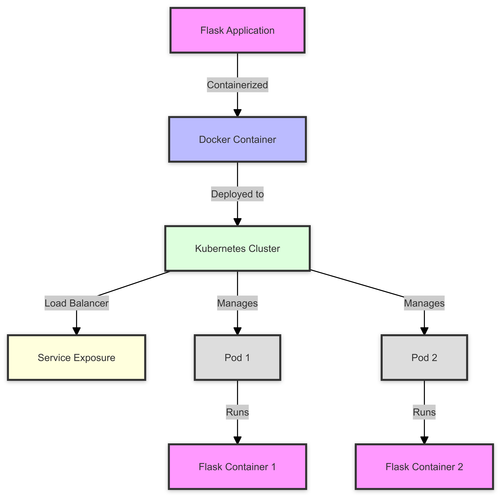

# Flask Application in Kubernetes 🚀

[](https://github.com/TheToriqul/Flask-App-In-Kubernetes)
[](https://github.com/TheToriqul/Flask-App-In-Kubernetes/stargazers)


## 🔍 Overview

This project demonstrates the deployment of a Flask REST API application in Kubernetes using Docker containerization and Makefile automation. It serves as a practical example of modern containerized application deployment in a Kubernetes environment.

## 🛠 Technologies Used

- Python 3.9
- Flask Framework
- Docker
- Kubernetes
- Make (for automation)
- REST API principles

## ⭐ Key Features

- RESTful Flask API endpoints
- Docker containerization
- Kubernetes deployment with replication
- Automated build and deployment process
- Load balanced service exposure

## 🏗 Project Architecture

See diagram for the detailed system architecture diagram.

   <figure >
    <p align="center">
        
        <p align="center">Project Architecture</p> 
    </p>
   </figure>

## 📥 Installation

1. Clone the repository:

   ```bash
   git clone https://github.com/TheToriqul/Flask-App-In-Kubernetes.git
   cd Flask-App-In-Kubernetes
   ```

2. Install dependencies:

   ```bash
   python -m pip install -r requirements.txt
   ```

3. Configure Docker and Kubernetes:
   - Ensure Docker is installed and running
   - Configure kubectl with your Kubernetes cluster
   - Update the image name in deployment.yaml

## 🚀 Usage

1. Build and deploy using Make:

   ```bash
   make all
   ```

2. Access the application:

   ```bash
   kubectl get svc flask-app-service
   ```

3. Clean up resources:
   ```bash
   make clean
   ```

## 📁 Project Structure

```
Flask-App-In-Kubernetes/
├── app.py              # Flask application
├── Dockerfile          # Container configuration
├── deployment.yaml     # Kubernetes deployment
├── Makefile           # Automation scripts
├── requirements.txt    # Python dependencies
├── architecture.md     # Architecture diagram
└── README.md          # Documentation
```

## ⚙️ Configuration

1. Update Docker Hub username in Makefile:

   ```makefile
   IMAGE_NAME=your-docker-hub-username/flask-app
   ```

2. Modify Kubernetes namespace if needed:
   ```makefile
   KUBE_NAMESPACE=default
   ```

## 🎯 Learning Objectives

Through this project, you'll understand:

- Container orchestration with Kubernetes
- Microservice deployment patterns
- CI/CD automation principles
- Load balancing and scaling strategies

## 📚 Further Learning

- Implement CI/CD pipelines
- Add monitoring and logging
- Implement database integration
- Explore Kubernetes autoscaling
- Add API authentication

## 🤝 Contributing

1. Fork the repository
2. Create a feature branch
3. Commit your changes
4. Push to the branch
5. Open a Pull Request

## 📞 Contact

- 📧 Email: toriqul.int@gmail.com
- 📱 Phone: +65 8936 7705, +8801765 939006

## 🔗 Project Links

- [GitHub Repository](https://github.com/TheToriqul/Flask-App-In-Kubernetes)

## 👏 Acknowledgments

- Poridhi Labs
- Flask documentation
- Kubernetes community
- Docker documentation

---

Copyright © 2024 TheToriqul. All Rights Reserved.
